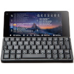

# Astro Slide 5G

  
|Component   |Description                                    |
|------------|-----------------------------------------------|
|CPU         |MediaTek Dimensity 800, MT6873 Octa-Core 5G SoC|
|GPU         |Arm Mali-G57 MC4 GPU Manhattan 3.0: 52fps      |
|APU         |3rd Generation Quad-core APU 3.0. Up to 2.5TOPS|
|RAM         |8GB                                            |
|Storage     |128GB                                          |
|Screen      |6.39" 2340x1080 Capacitive Touch               |
|Main Camera |48MP                                           |
|Front Camera|13MP                                           |
|Slot        |MicroSD                                        |
|Keyboard    |QWERTY with Backlit                            |
|Port        |USB-TypeC                                      |
|Bluetooth   |v5.1                                           |
|WLAN        |Wi-Fi 802.11 a/b/g/n/ac/e/k/r/h                |
|Battery     |3.7V 4000mA                                    |
|Dimension   |172mm x 76.5mm x 17.8mm                        |
|Weight      |300g                                           |

### https://steward-fu.github.io/website/index.htm
